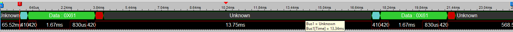

# pl011-no-fifo
This is a modification of the original *PL011* driver to enable low-delay, single-byte communication. While it's been designed specifically for [eBUS](https://en.wikipedia.org/wiki/EBUS_(serial_buses)) needs, it can be used for any similar purpose where delays between individual serial bytes must be kept as short as possible.

## Intro
UART on Raspberry platforms can run on either *mini UART* or *PL011* chip. People familiar with Raspberry know that whenever there is a need for a fast and robust serial communication, the *PL011* chip is the primary choice, so from now on when I speak about UART on Raspberry, I always mean *PL011*.

> [!IMPORTANT]
> This doc assumes you have your UARTs configured properly. By "properly" I mean a configuration where *PL011* chip is the primary UART i.e. the UART exposed on GPIOs 14 and 15. The [official documentation](https://www.raspberrypi.com/documentation/computers/configuration.html#configure-uarts) decently explains the difference between the primary and secondary UART, and describes how to make *PL011* the primary UART (not always needed, some Raspberries use *PL011* as the primary UART by default).

The mainline *PL011* driver which is embedded into Raspbian distribution is more than enough for *usual* use-cases. Are there unusual scenarios then? Well, yes. The prominent example is the [eBUS](https://en.wikipedia.org/wiki/EBUS_(serial_buses)) protocol used exclusively by boilers and thermostats to exchange control messages. eBUS's data link layer is just like UART (2400 bps, single start bit, single stop bit, no parity bit). The physical part is way different but that's out of scope of this repository.

So, we can use Raspberry to talk to boilers and thermostats, right? Almost, the catch here is that eBUS requires very fast responses from the bus participants. The precise times given in the protocol specification are vaguely described, and they could differ amongst thermostats and boilers, but usually the bus participants respond to synchronization messages after roughly 100 to 200 microseconds (slightly longer delays are also acceptable). UART itself doesn't impose any strict time gaps between individual bytes because it only cares about the number of bods per second. As long as this is satisfied by both devices, the bytes can be sent even one per hour and this is fine.

When you connect Raspberry to eBUS (with a proper level converter if you don't want to fry the board), and run [ebusd](https://github.com/john30/ebusd), you will see lots of errors and/or garbage data. Assuming the level converter works, the problem could be the hardware not responding fast enough. Is 200 microseconds a challenge for new Raspberries? It shouldn't be, that's an eternity for a CPU clocked with gigahertz values, so where is the problem?

## Anatomy of the problem
I played with a logic analyzer to see how the UART communication really looks like on the wires. I tied RX and TX together, and wrote a simple test program where a single byte is sent, then the program waits for reception, and another byte is sent again (write/read/write). The logic analyzer's output was:



The delay between two writes is roughly 13 milliseconds. That means once the byte appears on the wires there is 13 milliseconds of nothingness before Raspberry eventually responds. Knowing that eBUS participants usually respond after 100 microseconds, a response sent after 13 milliseconds is a prehistory. But why it takes so long for Raspberry to sent something through UART? The answer can be found in *PL011* documentation.

### RX/TX FIFO
*PL011* chip has two FIFO queues - one for receiving, the other one for transmitting. In the *PL011* [documentation](https://developer.arm.com/documentation/ddi0183/g/functional-overview/operation/uart-operation?lang=en#id3366904) it is said that once a new data appears in the TX FIFO, it is immediately sent out. Simple as that. However, the RX FIFO behaves differently. When *PL011* receives a data byte, it places it in the RX FIFO, and each consecutive byte follows the same path. When the desired number of bytes is stored in the FIFO, an interrupt is triggered, so the operating system knows it can read contents of the FIFO in batch. What if the number of received bytes isn't enough to trigger the interrupt? In such case, yet another interrupt is triggered but only after a certain amount of time. According to the documentation, the timeout is equal to 32-bit period. For 2400 bps, 32-bit period is equal to: `(1/2400) * 32 = 0,01(3) s ≈ 13,3 ms`. What a "coincidence", this is almost equal to the delay I observed with the logic analyzer.

Okay, the problem was found, does it mean FIFOs are pure evil and should be avoided? Not at all. As I already mentioned, UART doesn't care about delays between individual bytes, and the delay isn't present at all when the communication involves longer streams of data; in fact, FIFOs are crucial when data is transmitted at higher baudrates. Cases where the delay introduced by FIFO is noticeable and adverse are very specific (like eBUS). 

### PL011 driver implementation
The mainline driver for the *PL011* chip can be found in the Raspbian repo in: [drivers/tty/serial/amba-pl011.c](https://github.com/raspberrypi/linux/blob/rpi-6.6.y/drivers/tty/serial/amba-pl011.c). The most interesting part of this file is the `pl011_set_termios` function which sets up various connection parameters. Amongst them, there are these two lines:

```c
if (uap->fifosize > 1)
    lcr_h |= UART01x_LCRH_FEN;
```

The `uap->fifosize` contains either 16 or 32 depending on the chip revision, but it is never 1 or less, that means the FIFO is always enabled through asserting the `FEN` bit in [UARTLCR_H](https://developer.arm.com/documentation/ddi0183/g/programmers-model/register-descriptions/line-control-register--uartlcr-h?lang=en) register. There is no way to disable FIFO programmatically from user space, even with sophisticated hacks. The only way to do this is implementing a custom driver which either disables FIFO permanently, or at least exposes an option to disable it on demand.


### The solution
Just for a quick verification of my suspicions I had barbarically removed the two lines from the driver code, compiled it, and used it in place of the original. After a system reboot I ran ebusd again, and... it worked! The console started filling up with properly decoded eBUS messages, and I was able to send my own too. Raspberry remained connected to my apartment's heating circuit for a whole winter (in my country this is 4 months minimum), and the communication with the bus wasn't interrupted even once.

When I did the same write/read/write test as before, this is what I saw in the logic analyzer's output:


The gap is now only 30 **microseconds** short. The delay is so tiny that some buses even might require enabling artificial lag in ebusd so other bus participants can keep up. 

## Build
As mentioned earlier, the only way to disable FIFO is to use a modified driver, and this is the reason I created this repository. The driver can be compiled either on the Raspberry directly, or it can be cross-compiled under other system. Cross-compilation for Raspberry requires more steps, and I'm too lazy to explain how to set up the environment, so I go with the easier solution which is obviously compiling on the target system. Besides, it's only a single module, not a complete Kernel.

### Get requirements
#### Tools
```shell
$ sudo apt install bc bison flex libssl-dev make
```

#### Kernel headers
If you use a 64-bit version of Raspberry Pi OS, run the following command to install the kernel headers:

```shell
$ sudo apt install linux-headers-rpi-v8
```
If you use a 32-bit version of Raspberry Pi OS, run the following command to install the kernel headers:

```shell
$ sudo apt install linux-headers-rpi-{v6,v7,v7l}
```

### Build

In repository's root run:

```shell
$ make
```

When there were no errors, there should be a file named `amba-pl011-nofifo.ko` in the repository's root. Good job, the easy part is done.

## Install
This is going to be fun. The mainline *PL011* driver is built into the Kernel, which means it can't be simply removed with `rmmod`. It still shouldn't be a problem because Kernel allows to override drivers by writing to the `driver_override` property of a device, but the previous driver must be explicitly unbounded in order to load the new driver (this is because the driver matching mechanism walks over devices with no drivers assigned). Okay, cool, that means the driver can be unbounded by writing to the `unbind` property of it, right? Right? That's correct, unless this has been disabled in the driver's code deliberately. Unfortunately, the mainline *PL011* driver has this issue:

```c++
.drv = {
    .name = "uart-pl011",
    .pm	= &pl011_dev_pm_ops,
    .suppress_bind_attrs = IS_BUILTIN(CONFIG_SERIAL_AMBA_PL011),
}
```

That `suppress_bind_attrs` is what prevents `bind` and `unbind` properties from being added to the driver's sysfs. It's conditional, that means those properties are available only when the driver is built as a module.

Fine, how about Device Tree overlay? Good idea, however, that works only if the driver is matched by the `compatible` property, but the mainline driver matches the serial device by its AMBA peripheral ID. The `amba_match` function from [drivers/amba/bus.c](https://github.com/raspberrypi/linux/blob/rpi-6.6.y/drivers/amba/bus.c#L207) doesn't even try to match against what is inside `compatible`, and I didn't want to mess with peripheral IDs. It started to be really frustrating at this point, because I wanted to find a solution which doesn't require rebuilding the whole Kernel just to mark the *PL011* driver as module; that's just too much hassle for such a simple thing. Thankfully, there is one more way out.

### Blacklist initcall
Kernel can be told to ignore selected *init* functions of modules, even if the module is built into the Kernel image. It's as simple as it sounds - the *init* methods which are listed in the `initcall_blacklist` Kernel command line property won't run on system boot. Let's give it a try. Edit the `/boot/firmware/cmdline.txt` (or `/boot/cmdline.txt` on older Raspbians) and add the following property to the command line:

```
initcall_blacklist=pl011_init
```

Now, reboot the system, and when it's up again verify that `/sys/bus/amba/drivers` directory doesn't have `uart-pl011` entry. The `dmesg` output should also say that the init method has been blocked:

```
[    0.000000] blacklisting initcall pl011_init
...
[    0.135073] initcall pl011_init blacklisted
```

At last! Now, the last step is...

### Install driver
The installation is as simple as running:

```shell
$ sudo make install
```

The last thing to do is to reboot the system again, and when it's up, the output of `dmesg | grep PL011` should show the following line:

```
[   50.596508] Serial: AMBA PL011 UART driver (disabled FIFO)
```

Now, I can run *ebusd*, and it works like a charm. Below is a fragment of the output:

```
$ sudo ebusd -d /dev/ttyAMA0 -s -f -D

2024-09-29 15:58:06.818 [bus notice] device status: transport opened
2024-09-29 15:58:06.821 [main notice] ebusd 23.3.23.3-81-g59edf1a2 started with broadcast scan on device: /dev/ttyAMA0, serial
2024-09-29 15:58:07.893 [bus notice] bus started with own address 31/36
2024-09-29 15:58:07.893 [bus notice] signal acquired
2024-09-29 15:58:09.063 [bus notice] new master 10, master count 2
2024-09-29 15:58:09.124 [bus notice] new master 03, master count 3
2024-09-29 15:58:09.125 [update notice] received unknown MS cmd: 1008b5110101 / 094d500080ffff0000ff
2024-09-29 15:58:10.989 [update notice] received unknown BC cmd: 10feb516080026581529090724
2024-09-29 15:58:14.047 [update notice] received unknown MS cmd: 1008b510090000006affff010100 / 0101
2024-09-29 15:58:17.894 [main notice] starting initial broadcast scan
2024-09-29 15:58:17.994 [update notice] sent write Broadcast Queryexistence QQ=31:
2024-09-29 15:58:19.122 [update notice] received unknown MS cmd: 1008b5110101 / 094d500080ffff0000ff
2024-09-29 15:58:21.066 [update notice] received unknown MS cmd: 1008b5040100 / 0a00ffffffffffffff0080
2024-09-29 15:58:24.075 [update notice] received unknown MS cmd: 1008b510090000006affff010100 / 0101
2024-09-29 15:58:28.174 [bus notice] scan 08: ;Vaillant;BAI00;0055;9501
2024-09-29 15:58:28.174 [update notice] store 08 ident: done
2024-09-29 15:58:28.175 [update notice] sent scan-read scan.08  QQ=31: Vaillant;BAI00;0055;9501
2024-09-29 15:58:28.175 [bus notice] scan 08: ;Vaillant;BAI00;0055;9501
2024-09-29 15:58:29.075 [main notice] read common config file vaillant/broadcast.csv
2024-09-29 15:58:29.170 [update notice] received unknown MS cmd: 1008b5110101 / 094d500080ffff0000ff
2024-09-29 15:58:29.384 [main notice] read common config file vaillant/general.csv
2024-09-29 15:58:29.721 [main notice] read common config file vaillant/scan.csv
2024-09-29 15:58:30.062 [main notice] read scan config file vaillant/08.bai.csv for ID "bai00", SW0055, HW9501
2024-09-29 15:58:30.639 [main notice] found messages: 223 (3 conditional on 28 conditions, 0 poll, 10 update)
2024-09-29 15:58:30.793 [update notice] sent unknown MS cmd: 3108b5090124 / 09003231313230323030
2024-09-29 15:58:30.934 [update notice] sent read Scan.08 Id QQ=31:
2024-09-29 15:58:31.047 [update notice] received update-write bai StatusCirPump QQ=10: off
2024-09-29 15:58:31.139 [update notice] sent read Scan.08 Id QQ=31:
2024-09-29 15:58:31.283 [update notice] sent read Scan.08 Id QQ=31: 21;12;02;0010006869;3100;005201;N6
2024-09-29 15:58:31.283 [bus notice] scan 08: ;21;12;02;0010006869;3100;005201;N6
2024-09-29 15:58:33.448 [bus notice] scan 15: ;Vaillant;E7C00;0211;7402
2024-09-29 15:58:33.448 [update notice] store 15 ident: done
2024-09-29 15:58:33.449 [update notice] sent scan-read scan.15  QQ=31: Vaillant;E7C00;0211;7402
2024-09-29 15:58:33.449 [bus notice] scan 15: ;Vaillant;E7C00;0211;7402
2024-09-29 15:58:33.599 [update notice] sent unknown MS cmd: 3115b5090124 / 09003231313733333030
2024-09-29 15:58:33.750 [update notice] sent read Scan.15 Id QQ=31:
2024-09-29 15:58:33.902 [update notice] sent read Scan.15 Id QQ=31:
2024-09-29 15:58:34.003 [bus notice] max. symbols per second: 104
2024-09-29 15:58:34.055 [update notice] sent read Scan.15 Id QQ=31: 21;17;33;0020118088;0082;006100;N3
2024-09-29 15:58:34.056 [bus notice] scan 15: ;21;17;33;0020118088;0082;006100;N3
2024-09-29 15:58:34.163 [update notice] received update-write bai SetMode QQ=10: auto;0.0;53.0;-;1;0;0;0;0;0
2024-09-29 15:58:34.960 [main notice] read scan config file vaillant/15.e7c.csv for ID "e7c00", SW0211, HW7402
2024-09-29 15:58:34.962 [main notice] found messages: 401 (3 conditional on 28 conditions, 0 poll, 10 update)
2024-09-29 15:58:39.073 [update notice] received read bai Status01 QQ=10: 38.5;40.0;-;-;-;off
2024-09-29 15:58:44.030 [update notice] received update-write bai SetMode QQ=10: auto;0.0;53.0;-;1;0;0;0;0;0
2024-09-29 15:58:49.078 [update notice] received read bai Status01 QQ=10: 38.5;40.0;-;-;-;off
2024-09-29 15:58:51.017 [update notice] received read bai DateTime QQ=10: nosignal;-:-:-;-.-.-;-
2024-09-29 15:58:54.075 [update notice] received update-write bai SetMode QQ=10: auto;0.0;53.0;-;1;0;0;0;0;0
```